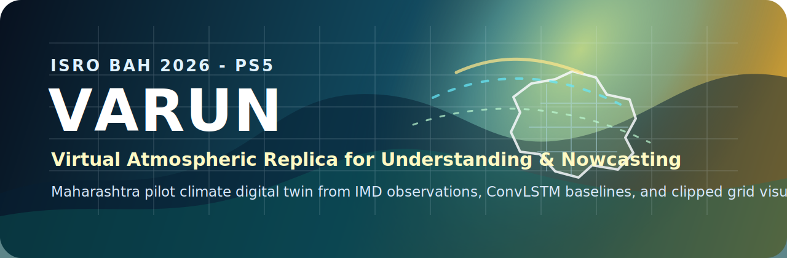
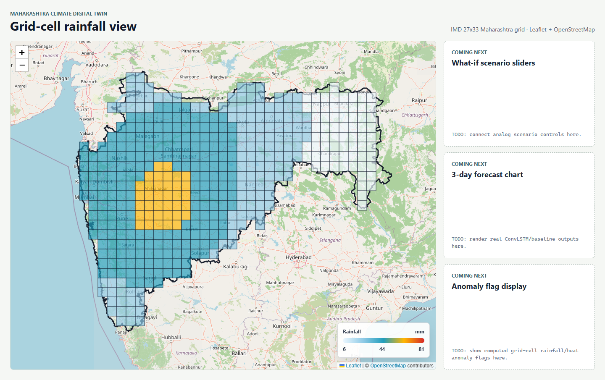

<p align="center">
  
</p>

# VARUN - Virtual Atmospheric Replica for Understanding & Nowcasting

[](https://www.python.org/)
[](https://pytorch.org/)
[](https://vite.dev/)
[](https://leafletjs.com/)
[](LICENSE)

**VARUN** is a Maharashtra-pilot climate digital twin prototype for **ISRO Bharatiya Antariksh Hackathon 2026, Problem Statement 5: AI-Powered Digital Twin of India's Climate using India's National Data**.

It currently fuses IMD gridded rainfall, maximum temperature, and minimum temperature into one Maharashtra climate tensor, trains a small GPU-first ConvLSTM one-day forecast model, compares it against transparent baselines, and visualizes the clipped Maharashtra grid in a React + Leaflet dashboard.

This repository is a working partial prototype, not a full national operational climate twin. INSAT/MOSDAC fusion, analog what-if scenarios, and anomaly flagging are planned next layers and are not represented as completed features.

<p align="center">
  
</p>

## Snapshot

| Layer | Current state |
| --- | --- |
| National-data foundation | IMD gridded rainfall, max temperature, and min temperature |
| Maharashtra tensor | `(4018, 27, 33, 3)` for complete years 2015-2025 |
| Grid resolution | IMD native 0.25 degree rainfall grid, not ward-level |
| Forecast model | 2-layer ConvLSTM, 10 past days to predict day+1 |
| Evaluation | Persistence and day-of-year climatology baselines |
| Dashboard | Vite + React + Leaflet map with local Maharashtra boundary overlay |
| Data policy | Raw and clean climate datasets are gitignored and must be downloaded/regenerated locally |

## Verified Results

Training was run on a GPU runtime, not on local CPU. Public-safe artifacts are committed in `outputs/training/run_2026-06-28_181137/`.

| Split | Date range |
| --- | --- |
| Training | 2015-01-01 to 2022-12-31 |
| Validation | 2023-01-01 to 2023-12-31 |
| Held-out test | 2024-01-01 to 2025-12-31 |

| Method | Rainfall RMSE | Rainfall MAE | Max Temp RMSE | Min Temp RMSE |
| --- | ---: | ---: | ---: | ---: |
| ConvLSTM | **9.61 mm** | **3.61 mm** | **1.05 degC** | **0.83 degC** |
| Persistence | 12.47 mm | 4.13 mm | 1.05 degC | 0.88 degC |
| Climatology | 11.53 mm | 4.25 mm | 2.02 degC | 1.84 degC |

These are real metrics from the committed training artifacts, not placeholder proposal numbers.

## What Is Built

- Verified binary parser for IMD rainfall `.grd` and max/min temperature `.GRD` files.
- Maharashtra crop and nearest-neighbour temperature regrid onto the rainfall grid.
- Timestamped dataset builder that processes only complete rainfall + maxT + minT year triplets.
- GPU-first ConvLSTM training and baseline evaluation script.
- Public-safe training result bundle with metrics, training history, comparison figure, and a small checkpoint.
- React + Leaflet dashboard with a 27 x 33 grid contract clipped to Maharashtra's real boundary.
- Explicit local boundary drawing so the grid does not depend on base-map border styling.

## Data Safety

Raw and clean climate data are **not committed**.

- IMD raw `.GRD` / `.grd` files stay under `datasets/raw_data/` locally.
- Generated clean `.npz` datasets stay under `datasets/clean_data/` locally.
- CSV exports and full prediction tensors are ignored by default.
- `test_predictions.npz` is intentionally not committed because it contains held-out truth tensors derived from licensed source data.
- `best_model.pt` is committed because it is small, about 277 KB, and contains model weights plus metadata rather than source grids.

Download IMD data directly from official sources before rebuilding locally:

- Rainfall 0.25 degree grid: https://www.imdpune.gov.in/cmpg/Griddata/Rainfall_25_Bin.html
- Maximum temperature 1.0 degree grid: https://imdpune.gov.in/cmpg/Griddata/Max_1_Bin.html
- Minimum temperature 1.0 degree grid: https://www.imdpune.gov.in/cmpg/Griddata/Min_1_Bin.html

## Project Layout

```text
BAH2026/
├── assets/                                    # README banner and public visual assets
├── datasets/
│   ├── raw_data/{rainfall,maxtemp,mintemp}/   # local only, gitignored except .gitkeep
│   └── clean_data/                            # local only, gitignored except .gitkeep
├── frontend/                                  # Vite React + Leaflet dashboard
├── outputs/training/run_2026-06-28_181137/    # public-safe result summary
├── scripts/
│   ├── imd_parser.py
│   └── maharashtra_fusion.py
├── build_dataset.py
├── npz_to_csv.py
├── train_model.py
├── requirements.txt
└── context.md
```

## Rebuild The Dataset

```bash
python -m pip install -r requirements.txt
python build_dataset.py
```

The builder scans the three raw-data folders, processes only years where rainfall, max temperature, and min temperature are all present, then writes a timestamped clean `.npz` without overwriting earlier runs.

Current verified clean tensor shape after adding 2015-2025 data: `(4018, 27, 33, 3)`.

## Train The Model

Use Google Colab or Kaggle with a GPU runtime. The script defaults to CUDA and fails clearly if CUDA is unavailable.

```bash
python train_model.py --epochs 10 --batch-size 32
```

For tiny local syntax or smoke checks only, pass `--device cpu` deliberately. Do not run full training on a local CPU machine.

## Run The Frontend

```bash
cd frontend
npm install
npm run dev
```

The dashboard uses Leaflet + OpenStreetMap tiles and does not require an API key, payment card, or backend service.

Current frontend scope:

- Maharashtra map centered on the IMD grid region.
- 27 x 33 placeholder grid contract.
- Grid clipped to the real Maharashtra boundary by cell center point.
- 450 rendered cells after clipping, down from the rectangular 891 cells.
- Explicit local boundary outline drawn above the grid.
- Reserved panels for future what-if controls, forecast output, and anomaly flags.

## Roadmap

- Add the analog what-if engine using historical nearest-neighbour matching.
- Add grid-cell rainfall and heat anomaly flagging from historical percentiles.
- Connect real model outputs into the frontend forecast panel.
- Integrate INSAT/MOSDAC channels later if access is available.

## Framing Notes

VARUN does not claim ward-level resolution, current flood-risk modeling, or replacement of physics-based numerical weather prediction. It is a data-fusion and decision-support prototype built from national datasets, with careful separation between verified implementation and planned scope.

## Citations

- Pai D.S. et al. (2014), *Development of a new high spatial resolution (0.25 x 0.25) long period daily gridded rainfall data set over India*, MAUSAM, 65(1), pp. 1-18.
- Srivastava A.K., Rajeevan M., Kshirsagar S.R. (2009), *Development of High Resolution Daily Gridded Temperature Data Set for the Indian Region*, Atmospheric Science Letters.

## License

MIT. See [LICENSE](LICENSE).
